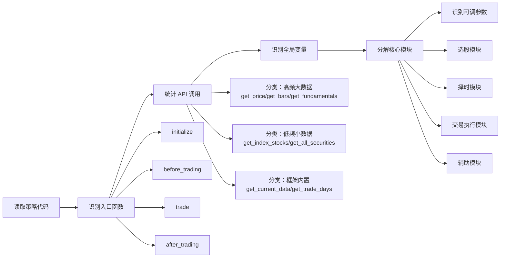
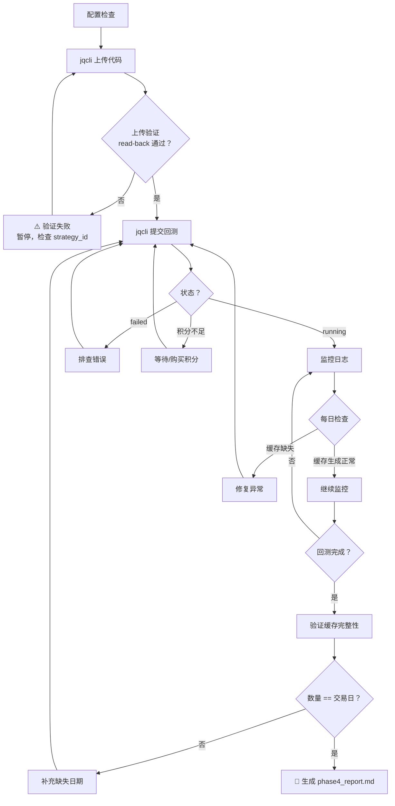
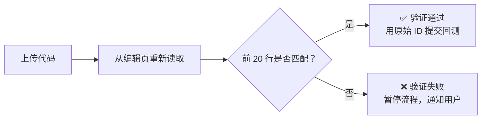
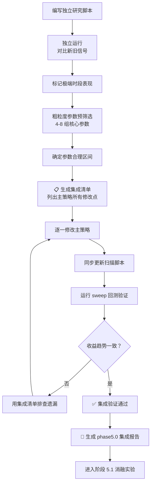
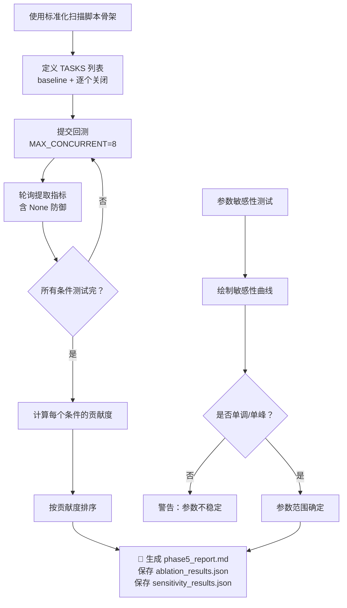
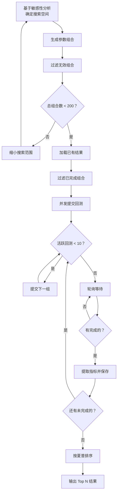
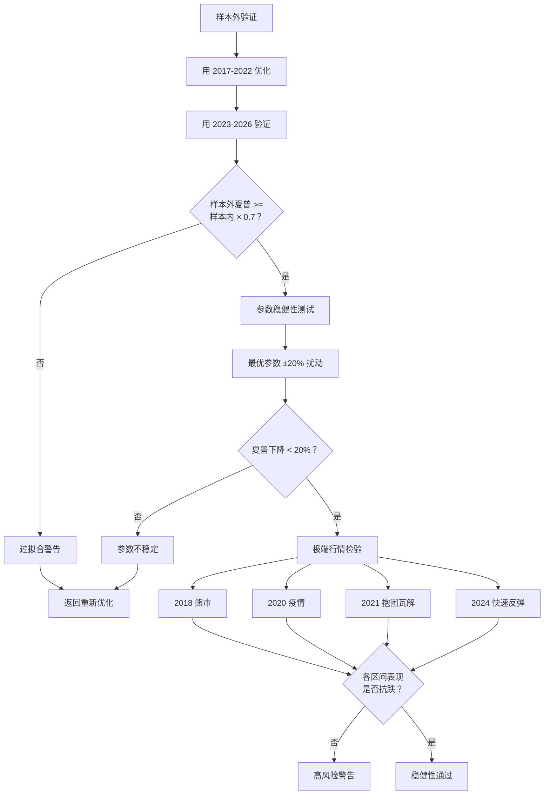
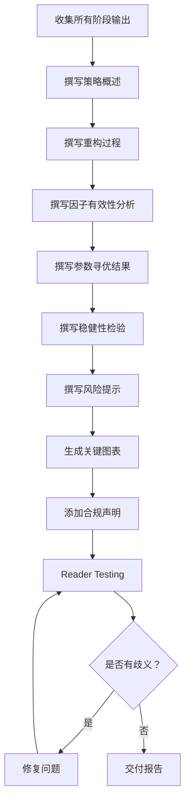

# 聚宽策略标准化优化 SOP 全景流程图

## 一、总体流程（Master Flow）

```mermaid
flowchart TD
    START([用户提交原始策略 .py]) --> INIT[初始化 Workspace<br/>创建 manifest.json]
    INIT --> STAGE1[阶段一：策略解构]
    STAGE1 --> CP1_1{CP-1.1 是否完整识别<br/>所有 API 调用？}
    CP1_1 -->|否| STAGE1
    CP1_1 -->|是| CP1_2{CP-1.2 所有慢 API<br/>是否规划缓存？}
    CP1_2 -->|否| STAGE1
    CP1_2 -->|是| CP1_3{CP-1.3 模块输入输出<br/>是否清晰？}
    CP1_3 -->|否| STAGE1
    CP1_3 -->|是| RPT1[📝 生成 phase1_deconstruct.md<br/>更新 manifest.json]
    RPT1 --> STAGE2[阶段二：架构重构]

    STAGE2 --> SKIP2{已有 PARAMS<br/>+ 函数解耦？}
    SKIP2 -->|是| RPT2_SKIP[📝 报告标注"已满足，跳过"]
    SKIP2 -->|否| CP2_1{CP-2.1 所有参数<br/>是否在 PARAMS 中？}
    CP2_1 -->|否| STAGE2
    CP2_1 -->|是| CP2_2{CP-2.2 每个择时条件<br/>能否独立开关？}
    CP2_2 -->|否| STAGE2
    CP2_2 -->|是| CP2_3{CP-2.3 主交易函数<br/>是否 <= 30 行？}
    CP2_3 -->|否| STAGE2
    CP2_3 -->|是| RPT2[📝 生成 phase2_refactor.md<br/>更新 manifest.json]
    RPT2_SKIP --> STAGE3
    RPT2 --> STAGE3[阶段三：缓存层设计]

    STAGE3 --> SKIP3{已有 collect/sweep<br/>缓存层？}
    SKIP3 -->|是| RPT3_SKIP[📝 报告标注"已满足，跳过"]
    SKIP3 -->|否| CP3_1{CP-3.1 缓存键<br/>是否规范命名？}
    CP3_1 -->|否| STAGE3
    CP3_1 -->|是| CP3_2{CP-3.2 sweep 恢复 +<br/>collect 保存是否完整？}
    CP3_2 -->|否| STAGE3
    CP3_2 -->|是| CP3_3{CP-3.3 meta 是否覆盖<br/>所有跨日累积数据？}
    CP3_3 -->|否| STAGE3
    CP3_3 -->|是| CP3_4{CP-3.4 断点续传<br/>逻辑是否正确？}
    CP3_4 -->|否| STAGE3
    CP3_4 -->|是| RPT3[📝 生成 phase3_cache_design.md<br/>更新 manifest.json]
    RPT3_SKIP --> STAGE4
    RPT3 --> STAGE4[阶段四：Collect 模式运行]

    STAGE4 --> SKIP4{缓存已存在<br/>且完整？}
    SKIP4 -->|是| RPT4_SKIP[📝 报告标注"已满足，跳过"]
    SKIP4 -->|否| CP4_1{CP-4.1 collect<br/>配置检查清单通过？}
    CP4_1 -->|否| STAGE4
    CP4_1 -->|是| CP4_2{CP-4.2 回测是否<br/>成功 running？}
    CP4_2 -->|否| 排查错误
    排查错误 --> STAGE4
    CP4_2 -->|是| CP4_2a{CP-4.2a 上传<br/>read-back 验证？}
    CP4_2a -->|否| 验证失败暂停
    验证失败暂停 --> STAGE4
    CP4_2a -->|是| CP4_3{CP-4.3 每天检查<br/>缓存生成？}
    CP4_3 -->|否| 修复异常
    修复异常 --> STAGE4
    CP4_3 -->|是| CP4_4{CP-4.4 缓存数量<br/>== 交易日数？}
    CP4_4 -->|否| 补充缺失日期
    补充缺失日期 --> STAGE4
    CP4_4 -->|是| RPT4[📝 生成 phase4_report.md<br/>更新 manifest.json]
    RPT4_SKIP --> STAGE5
    RPT4 --> STAGE5[阶段五：择时有效性验证]

    STAGE5 --> NEED50{需要新增/替换<br/>择时条件？}
    NEED50 -->|是| STAGE50[阶段 5.0：择时条件<br/>开发子流程]
    STAGE50 --> CP5_0{CP-5.0 集成验证<br/>是否通过？}
    CP5_0 -->|否| STAGE50
    CP5_0 -->|是| STAGE51[阶段 5.1：消融实验]
    NEED50 -->|否| STAGE51
    STAGE51 --> CP5_1{CP-5.1 每个择时条件<br/>独立贡献是否量化？}
    CP5_1 -->|否| STAGE51
    CP5_1 -->|是| CP5_2{CP-5.2 参数<br/>敏感性曲线已绘制？}
    CP5_2 -->|否| STAGE51
    CP5_2 -->|是| RPT5[📝 生成 phase5_report.md<br/>更新 manifest.json]
    RPT5 --> STAGE6[阶段六：参数寻优]

    STAGE6 --> CP6_1{CP-6.1 搜索空间<br/>是否经过预筛选？}
    CP6_1 -->|否| STAGE6
    CP6_1 -->|是| CP6_2{CP-6.2 并发脚本<br/>处理聚宽限制？}
    CP6_2 -->|否| STAGE6
    CP6_2 -->|是| CP6_3{CP-6.3 最优参数<br/>是否在边界？}
    CP6_3 -->|是| 扩展搜索空间
    扩展搜索空间 --> STAGE6
    CP6_3 -->|否| RPT6[📝 生成 phase6_report.md<br/>更新 manifest.json]
    RPT6 --> STAGE7[阶段七：稳健性检验]

    STAGE7 --> CP7_1{CP-7.1 样本外夏普<br/>>= 样本内 × 0.7？}
    CP7_1 -->|否| 警告过拟合
    警告过拟合 --> STAGE6
    CP7_1 -->|是| CP7_2{CP-7.2 参数扰动后<br/>夏普下降 < 20%？}
    CP7_2 -->|否| 警告过拟合
    CP7_2 -->|是| CP7_3{CP-7.3 极端行情<br/>是否抗跌？}
    CP7_3 -->|否| 警告风险
    CP7_3 -->|是| RPT7[📝 生成 phase7_report.md<br/>更新 manifest.json]
    RPT7 --> STAGE8[阶段八：报告撰写]

    STAGE8 --> CP8_1{CP-8.1 报告含 >=3<br/>个关键图表？}
    CP8_1 -->|否| STAGE8
    CP8_1 -->|是| CP8_2{CP-8.2 是否含<br/>合规风险提示？}
    CP8_2 -->|否| STAGE8
    CP8_2 -->|是| RPT8[📝 生成 final_report.md<br/>更新 manifest.json]
    RPT8 --> DELIVER([交付最终报告])

    %% 断点恢复路径
    RECOVER([会话中断，读取 manifest.json<br/>恢复到 current_phase]) -.-> STAGE1
    RECOVER -.-> STAGE2
    RECOVER -.-> STAGE3
    RECOVER -.-> STAGE4
    RECOVER -.-> STAGE5
    RECOVER -.-> STAGE6
    RECOVER -.-> STAGE7
    RECOVER -.-> STAGE8
```

---

## 二、阶段一详解：策略解构



**输出物**：`策略解构报告.md` → 保存到 `jq_optimizer_workspace/phase1_deconstruct.md`
- API 调用清单（含位置、频率、数据量估计）
- 模块依赖图
- 可调参数表（含含义、范围、默认值）

---

## 三、阶段二详解：架构重构

```mermaid
flowchart TD
    A[原始策略：耦合代码] --> B[提取 PARAMS 字典]
    B --> C[设计择时开关]
    C --> D[解耦为独立函数]
    D --> E[消除类层次]
    E --> F[重构后策略]

    B --> B1[所有可调参数集中到 PARAMS]
    B --> B2[注释说明含义和范围]
    B --> B3[initialize 中复制到 g.timing_params]

    C --> C1[每个条件一个 enabled 布尔值]
    C --> C2[默认 True/False 标注]
    C --> C3[开关命名：{name}_enabled]

    D --> D1[trade() 不超过 30 行]
    D --> D2[每个择时条件独立函数]
    D --> D3[每个选股步骤独立函数]
    D --> D4[函数间通过参数传递]
```

**关键设计决策**：

| 决策点 | 选项 A | 选项 B | 推荐 |
|--------|--------|--------|------|
| 参数存储 | 分散在 g.* | 集中到 PARAMS | A（已验证可行） |
| 择时架构 | 类层次（TimingEngine） | 独立函数 + 开关 | B（更简洁） |
| 函数粒度 | 大函数（100+ 行） | 小函数（< 50 行） | B（易维护） |

---

## 四、阶段三详解：缓存层设计

```mermaid
flowchart TD
    A[确定三模式] --> B[设计缓存键]
    B --> C[实现拦截模式]
    C --> D[设计 Meta 数据]
    D --> E[实现断点续传]

    A --> A1[live: 正常模式]
    A --> A2[collect: 收集缓存]
    A --> A3[sweep: 使用缓存]

    B --> B1[格式: {HH:MM}__{func}__{type}]
    B --> B2[09:00 盘前数据]
    B --> B3[09:45/11:25 盘中数据]
    B --> B4[14:57 尾盘数据]

    C --> C1[sweep: if cache_key in g.cache_dict]
    C --> C2[collect: g.cache_dict[cache_key] = result]
    C --> C3[live: 不走任何缓存分支]

    D --> D1[meta.pkl.gz: cumulative_data]
    D --> D2[meta.pkl.gz: event_log]
    D --> D3[meta.pkl.gz: performance_log]
    D --> D4[meta.pkl.gz: custom_history]

    E --> E1[collect 也加载 meta]
    E --> E2[检查当日缓存是否存在]
    E --> E3[存在则 g._skip_today = True]
    E --> E4[after_market_close 跳过保存]
```

**缓存拦截代码模板**：

```python
def cached_function(context, ...):
    tp = str(context.current_dt)[-8:]
    cache_key = '{0}__function_name'.format(
        tp[:5] if tp >= '11:00' else '09:45'
    )
    
    # sweep 模式：从缓存恢复
    if CACHE_MODE == 'sweep' and g.cache_dict and cache_key in g.cache_dict:
        return g.cache_dict[cache_key]
    
    # 正常逻辑
    result = expensive_api_call(...)
    
    # collect 模式：保存到缓存
    if CACHE_MODE == 'collect':
        g.cache_dict[cache_key] = result
    
    return result
```

---

## 五、阶段四详解：Collect 模式运行



**上传验证详解（CP-4.2a）**：



**为什么需要上传验证**：
- `jqcli strategy edit` 内部的 `_find_strategy_by_name` 可能找到同名策略
- 返回的 ID 可能不是实际更新的策略
- **必须用原始 strategy_id 提交回测**（非返回的 save_id）

**jqcli 提交流程**：

```bash
# Step 1: 更新策略代码
jqcli strategy edit {algo_id} --file strategy.py

# Step 2: 提交回测（后台运行）
jqcli backtest run {algo_id} \
  --start 2017-01-01 \
  --end 2026-05-26 \
  --capital 1000000 \
  --freq minute

# Step 3: 获取 bt_id，轮询状态
while true; do
  status=$(jqcli backtest show {bt_id} | grep "状态" | awk '{print $2}')
  echo "Status: $status"
  if [[ "$status" == "done" || "$status" == "failed" ]]; then
    break
  fi
  sleep 60
done

# Step 4: 获取结果
jqcli backtest stats {bt_id} --format json
```

---

## 六、阶段五详解：择时有效性验证

### 6a. 阶段 5.0 子流程（新增/替换择时条件时）



**集成清单模板**：

| # | 文件 | 行号 | 修改内容 | 状态 |
|---|------|------|---------|------|
| 1 | {strategy}.py | L{N} | 新增 `{condition}_enabled` 参数 | ⬜ |
| 2 | {strategy}.py | L{N} | 替换旧参数为新参数组 | ⬜ |
| 3 | {strategy}.py | L{N} | 新增 `{condition}()` 函数 | ⬜ |
| 4 | {strategy}.py | L{N} | 更新调用点引用 | ⬜ |

### 6b. 阶段 5.1 消融实验（择时条件开关验证）



**择时条件贡献度计算方法**：

```python
base_result = run_with_all_enabled()  # 基准

contributions = {}
for condition in timing_conditions:
    # 关闭该条件，其他保持开启
    result = run_with_condition_disabled(condition)
    
    # 贡献度 = 基准夏普 - 关闭后夏普
    contribution = base_result['sharpe'] - result['sharpe']
    contributions[condition] = contribution

# 排序：贡献度从高到低
sorted_contributions = sorted(contributions.items(), key=lambda x: x[1], reverse=True)
```

---

## 七、阶段六详解：参数寻优



**并发扫描脚本架构**：

```python
# sweep_runner.py 核心逻辑

class SweepRunner:
    def __init__(self, algo_id, param_grid, max_concurrent=10):
        self.algo_id = algo_id
        self.param_grid = param_grid
        self.max_concurrent = max_concurrent
        self.active = {}  # bt_id -> {key, params, seq}
        self.completed = self.load_existing_results()
        
    def run(self):
        combos = self.make_combinations()
        remaining = [c for c in combos if self.param_key(c) not in self.completed]
        
        idx = 0
        total = len(remaining)
        
        while self.active or idx < total:
            # 补充新回测
            while len(self.active) < self.max_concurrent and idx < total:
                self.submit_next(remaining[idx], idx + 1, total)
                idx += 1
            
            # 轮询所有活跃回测
            done_ids = []
            for bt_id, info in list(self.active.items()):
                try:
                    status = self.check_status(bt_id)
                    if status == 'done':
                        metrics = self.extract_metrics(bt_id)
                        self.save_result(info['key'], info['params'], metrics)
                        done_ids.append(bt_id)
                    elif status in ('failed', 'cancelled'):
                        done_ids.append(bt_id)
                except Exception as e:
                    print(f"[轮询异常] {bt_id}: {e}")
            
            # 移除已完成的
            for bt_id in done_ids:
                del self.active[bt_id]
            
            if self.active:
                time.sleep(15)
        
        self.print_final_report()
```

---

## 八、阶段七详解：稳健性检验



**分年度收益表模板**：

| 年份 | 策略收益 | 基准收益 | 超额收益 | 最大回撤 | 夏普 |
|------|---------|---------|---------|---------|------|
| 2017 | xx% | xx% | xx% | xx% | x.xx |
| 2018 | xx% | xx% | xx% | xx% | x.xx |
| ... | ... | ... | ... | ... | ... |
| 2026 | xx% | xx% | xx% | xx% | x.xx |

---

## 九、阶段八详解：报告撰写



**报告必备图表**：

1. **收益曲线对比图**：原始策略 vs 优化后策略 vs 基准
2. **参数敏感性热力图**：双参数交互效应（如 lookback × forward）
3. **IC 时间序列图**：核心因子的月度 IC 走势
4. **回撤分布图**：策略回撤的时间分布和幅度
5. **分年度收益柱状图**：逐年收益对比
6. **择时条件贡献度条形图**：各条件的夏普贡献排序

---

## 十、关键决策矩阵

| 场景 | 决策 | 原因 |
|------|------|------|
| 参数在搜索空间边界 | 扩展搜索范围 | 边界极值可能不是全局最优 |
| 样本外夏普 < 样本内 × 0.5 | 回退到更保守参数 | 严重过拟合 |
| 某择时条件贡献度为负 | 默认关闭该条件 | 该条件反而降低收益 |
| ICIR < 0.5 | 降低该因子权重或移除 | 因子不稳定 |
| 极端行情回撤 > 40% | 增加风控条件或降低仓位 | 风险过高 |
| 并发提交遇到"最多10个"错误 | 等待槽位释放，不标记失败 | 聚宽限制，非真正失败 |

---

## 十一、工具链

| 工具 | 用途 | 命令 |
|------|------|------|
| jqcli | 策略管理、回测提交 | `jqcli strategy edit`、`jqcli backtest run` |
| Python + pandas | 数据分析、因子检验 | `pandas`, `numpy`, `scipy.stats` |
| matplotlib/seaborn | 图表绘制 | `plt.plot()`, `sns.heatmap()` |
| pickle + gzip | 缓存序列化 | `pickle.dumps()`, `gzip.compress()` |
| Git | 版本控制 | `git commit`, `git diff` |

---

## 十二、常见陷阱与规避

| 陷阱 | 症状 | 规避方法 |
|------|------|---------|
| **缓存键冲突** | sweep 模式数据错乱 | 使用 `{HH:MM}__{func}__{type}` 规范命名，同一函数多时间点必须用时间前缀区分 |
| **sweep 污染累积数据** | event_log 重复膨胀 | sweep 模式只读缓存，不 append；累积数据写入前检查 `CACHE_MODE != 'sweep'` |
| **collect 覆盖已有 meta** | cumulative_data 丢失历史 | collect 先加载 meta，新日期追加 |
| **meta 保存顺序错误** | daily 成功但 meta 失败导致累积数据丢失 | 先保存 meta，再保存 daily_cache |
| **参数过拟合** | 样本外表现急剧下降 | 样本外验证 + 参数扰动测试 |
| **并发提交错误标记** | 因"最多10个"导致参数被标记 error | 捕获错误，返回 False 让主循环等待，不标记 failed |
| **refresh_csv 覆盖 bug** | hasattr(g, g.csv_name) 永远为 False | 检查 `hasattr(g, 'data') and not g.data.empty` |
| **前复权缓存不稳定** | 未来除权改变所有历史价格 | 一律使用后复权 `fq='post'`，涨跌停检测单独用 `fq=None` |
| **缓存了参数相关数据** | sweep 模式参数改变后数据不匹配 | 只缓存原始市场数据，参数相关的计算结果不缓存 |
| **jqcli 上传不生效** | 回测结果与预期不符，代码实际未更新 | 上传后 read-back 验证（CP-4.2a），用原始 strategy_id 提交回测 |
| **API 返回 None** | `f"{None:.4f}"` 触发 TypeError | 使用 `safe_fmt()` 统一格式化，结果 JSON 允许 None 存在 |
| **会话中断丢失进度** | 全部重来，浪费时间 | 读取 manifest.json + 阶段报告自动恢复到 current_phase |
| **独立脚本用了 handle_data** | 分钟级重复调用，结果错误 | 独立研究脚本使用 `schedule` / `run_daily` |
| **集成遗漏修改点** | 新择时条件部分引用旧函数 | 使用集成清单逐一对照，grep 旧函数名确认无遗漏 |

---

## 十三、Workspace 文件管理一览

```
{策略文件同目录}/jq_optimizer_workspace/
├── manifest.json                     ← 📋 总索引（恢复入口）
├── phase1_deconstruct.md             ← 阶段 1 报告
├── phase2_refactor.md                ← 阶段 2 报告
├── phase3_cache_design.md            ← 阶段 3 报告
├── phase4_collect/
│   ├── phase4_report.md              ← 阶段 4 报告
│   └── cache_status.json
├── phase5_validation/
│   ├── phase5_report.md              ← 阶段 5 报告
│   ├── ablation_results.json
│   └── sensitivity_results.json
├── phase6_sweep/
│   ├── phase6_report.md              ← 阶段 6 报告
│   └── sweep_results.json
├── phase7_robustness/
│   ├── phase7_report.md              ← 阶段 7 报告
│   └── robustness_results.json
├── phase8_report/
│   └── final_report.md               ← 最终交付报告
└── scripts/
    ├── ablation_scan.py               ← 扫描脚本存档
    └── param_sweep.py
```

**断点恢复路径**：`manifest.json` → `current_phase` → 读取最近报告 → 检查中间产物 → 续跑

---

*本流程图与 SOP 文档配套使用，流程图展示全局视角，SOP 文档提供实现细节。*
